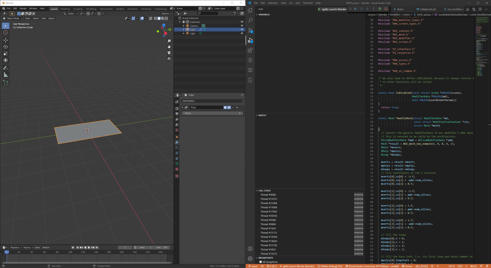

# Pizza Modifier Tutorial (For Blender 2.90 alpha)
This repository contain source code (26 June 2020) for Blender 2.90 with the "pizza modifier" from the tutorial by [exppad](https://twitter.com/exppad).

[Link to the tutorial](https://blog.exppad.com/article/writing-blender-modifier)

Expected result: 

I made some tweaks to implement the new modifier UI (Drag and drop system added in Blender 2.90) and a working appendix.
All changes I made may be listed here:

## Overview > Core modifier > Modifier Type Info
The new source code for *MOD_pizza.c* based on the "MOD_none.c":

	/*
	* This program is free software; you can redistribute it and/or
	* modify it under the terms of the GNU General Public License
	* as published by the Free Software Foundation; either version 2
	* of the License, or (at your option) any later version.
	*
	* This program is distributed in the hope that it will be useful,
	* but WITHOUT ANY WARRANTY; without even the implied warranty of
	* MERCHANTABILITY or FITNESS FOR A PARTICULAR PURPOSE. See the
	* GNU General Public License for more details.
	*
	* You should have received a copy of the GNU General Public License
	* along with this program; if not, write to the Free Software Foundation,
	* Inc., 51 Franklin Street, Fifth Floor, Boston, MA 02110-1301, USA.
	*
	* The Original Code is Copyright (C) 2005 Blender Foundation.
	* All rights reserved.
	*/

	/** \file
	* \ingroup modifiers
	*/

	#include  <stdio.h>
	
	#include  "BKE_modifier.h"
	
	/* We only need to define isDisabled; because it always returns 1,
	* no other functions will be called
	*/

	static  bool  isDisabled(const  struct Scene *UNUSED(scene),
				ModifierData *UNUSED(md),
				bool  UNUSED(userRenderParams))
	{
		return  true;
	}
	
	ModifierTypeInfo modifierType_Pizza = {
        /* name */  "Pizza",
        /* structName */  "PizzaModifierData",
        /* structSize */  sizeof(PizzaModifierData),
        /* type */ eModifierTypeType_None,
        /* flags */ eModifierTypeFlag_AcceptsMesh,

        /* copyData */ BKE_modifier_copydata_generic,

        /* deformVerts */  NULL,
        /* deformMatrices */  NULL,
        /* deformVertsEM */  NULL,
        /* deformMatricesEM */  NULL,
        /* modifyMesh */ NULL,
        /* modifyHair */  NULL,
        /* modifyPointCloud */  NULL,
        /* modifyVolume */  NULL,

        /* initData */  NULL,
        /* requiredDataMask */  NULL,
        /* freeData */  NULL,
        /* isDisabled */  isDisabled,
        /* updateDepsgraph */  NULL,
        /* dependsOnTime */  NULL,
        /* dependsOnNormals */  NULL,
        /* foreachObjectLink */  NULL,
        /* foreachIDLink */  NULL,
        /* foreachTexLink */  NULL,
        /* freeRuntimeData */  NULL,
        /* panelRegister */ NULL,
        /* blendWrite */  NULL,
        /* blendRead */  NULL,
	};

## Overview > Core modifier  > Apply Modifier [Renamed "modifyMesh"]
Since 2.90 introduce pointcloud, hair and Volume as new objects; the "applyModifier" was renamed to "modifyMesh".
  
	
	static Mesh *modifyMesh(struct ModifierData *md,
				const  struct ModifierEvalContext *ctx,
				struct Mesh *mesh)
	{
		return mesh;
	}

"And set the **modifyMesh** field (Inside of the ModifierTypeInfo) from NULL to **modifyMesh**" instead of "applyModifier" and "pizza_applyModifier".
You also need to change the "isDisabled" field to **NULL**.

## User Interface
The drag and drop support in the modifier tab no longer use python for displaying properties. Now UI needs to be added to the "MOD_*.c" file.

	/** Licence and previous includes **/
	#include  "DNA_screen_types.h"
	
	#include  "BKE_context.h"
	#include  "BKE_screen.h"

	#include  "UI_interface.h"
	#include  "UI_resources.h"

	#include  "MOD_ui_common.h"

	/** isDisabled and modifyMesh code here**/

	static  void  panel_draw(const bContext *C, Panel *panel)
	{
		uiLayout *sub, *row;
		uiLayout *layout = panel->layout;

		PointerRNA ptr;
		PointerRNA ob_ptr;
		modifier_panel_get_property_pointers(C, panel, &ob_ptr, &ptr);

		uiItemR(layout, &ptr, "num_olives", 0, NULL, ICON_NONE);

		modifier_panel_end(layout, &ptr);
	}

	static  void  panelRegister(ARegionType *region_type)
	{
		modifier_panel_register(region_type, eModifierType_Pizza, panel_draw);
	}
	
	/** ModifierTypeInfo **/

## Appendix: Example of modifyMesh

	#include  "DNA_mesh_types.h"
	#include  "DNA_meshdata_types.h"
	#include  "DNA_modifier_types.h"
	
	#include  "BKE_mesh.h"
	
	#include  "RNA_access.h"
	#include  "RNA_types.h"

	static Mesh *modifyMesh(struct ModifierData *md,
				const  struct ModifierEvalContext *ctx,
				struct Mesh *mesh)
	{
		// Convert the generic ModifierData to our modifier's DNA data.
		// This is ensured to be valid by the architecture.
		PizzaModifierData *pmd = (PizzaModifierData *)md;
		Mesh *result = BKE_mesh_new_nomain(4, 0, 0, 4, 1);
		MVert *mverts;
		MPoly *mpolys;
		MLoop *mloops;

		mverts = result->mvert;
		mpolys = result->mpoly;
		mloops = result->mloop;

		// Fill coordinates of the 4 vertices
		mverts[0].co[0] = -1.f;
		mverts[0].co[1] = -pmd->num_olives;
		mverts[0].co[2] = 0.f;

		mverts[1].co[0] = -1.f;
		mverts[1].co[1] = pmd->num_olives;
		mverts[1].co[2] = 0.f;

		mverts[2].co[0] = 1.f;
		mverts[2].co[1] = pmd->num_olives;
		mverts[2].co[2] = 0.f;

		mverts[3].co[0] = 1.f;
		mverts[3].co[1] = -pmd->num_olives;
		mverts[3].co[2] = 0.f;

		// Fill the loops
		mloops[0].v = 0;
		mloops[1].v = 1;
		mloops[2].v = 2;
		mloops[3].v = 3;

		// Fill the face info, i.e. its first loop and total number of loops
		mpolys[0].loopstart = 0;
		mpolys[0].totloop = 4;

		// Fill edge data automatically
		BKE_mesh_calc_edges(result, true, false);

		return result;
	}

# Acknowledgment
- A huge thank to exppad for bringing us this very good and clear tutorial.

